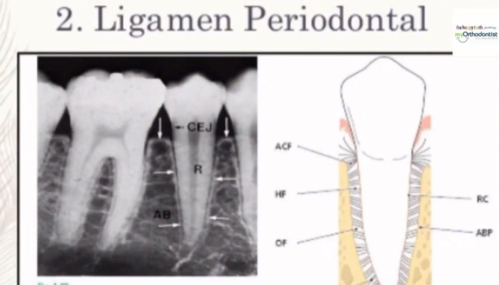
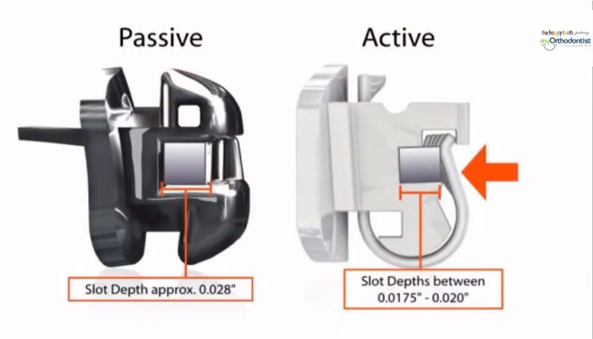

Hello everyone, this is Naomi with MyOrthodontist and today I’m going to answer one of our most frequently asked questions, which is “Do braces hurt?” The process of orthodontics uses tension and compression in order to move your teeth into their desired position. Underneath the gums, the bone and the ligament have to change in order for the teeth to move. This tension and compression caused by your braces can cause discomfort for a short period of time.

But because we are all about you, we start off our new patients who are undergoing [braces treatment](/types-of-braces/) with a high-tech super flexible light wire in order to minimize discomfort. We also have a new system of braces called passive self-ligating appliances, which also greatly increases comfort.

If you are someone who experiences discomfort, I have some great news. After the first adjustment or two, there is little if any discomfort, and patients often say, “I don’t think the last adjustment worked because my teeth didn’t hurt afterward.” Additionally, people getting orthodontics with the clear aligner system called Invisalign typically express even fewer issues with discomfort.

The great news about all this technology is that it greatly reduces the number of visits to your orthodontist. Much of what you need can be done virtually through our website. We hope that answers some of your questions and for more information visit our website for your free [new patient consultation](https://forms.formlync.com/myorthodontist/register).

MyOrthodontist is a family-focused orthodontic practice with [locations](/locations/) conveniently located throughout North Carolina, including [Chapel Hill](/locations/chapel-hill/), [Durham](/locations/durham/), [Greensboro](/locations/greensboro/), and [Raleigh](/locations/raleigh/). We offer Invisalign and in-house clear aligner treatments for teens and adults as well as several [braces options](/types-of-braces/). Call the MyOrthodontist office nearest you or click to schedule your [complimentary in-office or virtual consultation](https://forms.formlync.com/myorthodontist/register) today.
