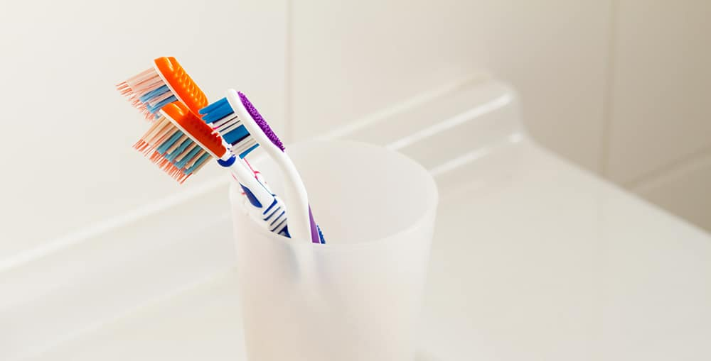

Help your Invisalign do its job better. One of the best things about the Invisalign straightening system is that you can take the apparatus in and out with ease. That way you don’t have to wear it when you are eating, playing sports, or ready to brush. You don’t have this option with conventional braces, and it quickly proves to be a major frustration.

Another advantage of taking Invisalign in and out is that you can clean it whenever you feel like it. Sometimes you may find that things have become trapped inside, or that the Invisalign has simply picked up some of the gunk that naturally accumulates in your mouth.

### How to Keep a Clean Invisalign

The easiest way to clean Invisalign straighteners is to brush them lightly with water using a dedicated toothbrush. Be sure to brush them on both the inside and the outside. You should do this at the same time you brush your teeth and strive to do it once a day. The best policy is not to use toothpaste or any kind of cleaning agent as these can damage the straighteners and cause them to discolor.

It really is that simple to clean Invisalign. What is so important to remember, however, is that you need to clean your straightener and clean your teeth. If you neglect your oral health while you are correcting your alignment issues, you will hurt your teeth at the same time you’re trying to make them better.

Since it is so easy to pop Invisalign in and out you should maintain the same oral health routine that you always do. Brush 2-3 times daily, ideally after meals, and floss at least once a day. That will help keep your teeth and gums healthy and help you avoid spending any more time in the dentist’s chair than you have to.

### MyOrthodontist can Help You with Invisalign

If you do not currently have Invisalign but would like to learn more about it, rely on the team at MyOrthodontist to provide you with the information you need. We are big fans of the treatment and have helped countless patients straighten their teeth without the embarrassment of traditional braces. We can help you with a consultation, tell you if you are a candidate for Invisalign, and fit you for straighteners. Find the [North Carolina office](/locations/) nearest you and book an appointment at your convenience.

[Learn About Us](/about/)
