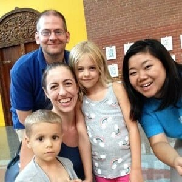

The team here at MyOrthodontist partnered with Zach’s Toy Chest to host a Christmas in July event over the last weekend in July. The event was held at the Marbles Kids Museum in Raleigh and proved to be a huge success that we were thrilled to be a part of.

### A Winter Wonderland

The museum was transformed into a winter wonderland complete with a tree, oversized gifts, and even Santa Claus himself. Kids had a chance to chat with Santa and have their picture taken with huge smiles on display all around.

#### Support For Children With Cancer

The event was held in order to support children and their families who have been suffering from pediatric cancer. In many cases these kids were confined to germ-free hospital environments over Christmas – and on birthdays, Halloween, Easter, etc. – and were not able to enjoy the magic of the holiday season like other kids.

#### 

#### Fun Times

In addition to being a Christmas themed event, this was a chance for the kids to play with one another and enjoy all the fun that the museum’s play spaces have to offer. In the same way that these kids miss out on holidays, they often miss out on the simple fun and goofiness of play that other kids get to take advantage of every day. By the sounds of laughter ringing out from all corners there was a lot of great times being had.

#### Thank You, Zach’s Toy Chest

We were happy to have [Zach’s Toy Chest](http://zachstoychest.org/) as our partner on this event because they do a ton of important work in the Raleigh community and beyond. The organization finds ways for kids and their families fighting pediatric cancer to relieve some of the day-to-day stress of treatments. This Christmas in July event is just one of the many ways they will help these families throughout the year.

#### A Win-Win

Based on the success of this year’s event, [MyOrthodontist](https://myorthodontistnc.com) fully anticipates hosting another one next year. This is a cause that we believe in strongly, and as dedicated members of the Raleigh community, we feel it is our part to do everything we can to give back. A big thank you to all who came out to support the children and their families.

[Find a Location](/locations/)  [Learn About Us](/about/)  [Explore Our Deals](/special-offers/)
