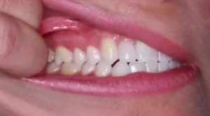
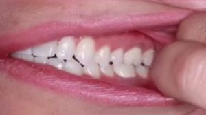
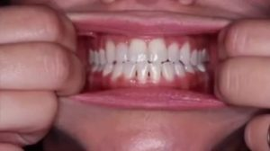
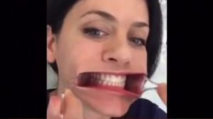
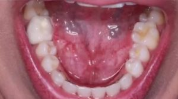
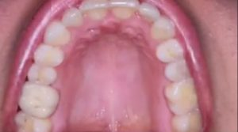
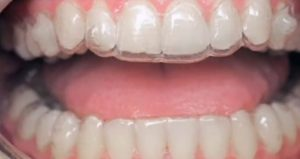

Hello everyone, this is Naomi with MyOrthodontist. Today I’m going to show you how to take your photos for your progress checks if you have Invisalign. The virtual consultation portal shows a great video on how to upload the pictures that we need.

The first pictures that we need are pictures of your front teeth and from each side.

  

The first things that you’ll need are clean hands and two plastic spoons. It’s important that when you’re taking pictures that we can see all the way to the back of your teeth. Let me show you an example:

It’s very important that you’re biting on your back teeth for these photos. If you’re not biting on your back teeth, it will be very difficult to make an accurate assessment of your bite. Please also take pictures of your top and bottom chewing surfaces like this (bottom):

Or like this (top):

After this, you will take a second series of photos with your clear aligners in. The main difference is that for the buckle center view – or the front facing view – when your aligners are in, your teeth will be slightly separated like this:

Please take all your pictures with your phone or camera facing vertically (portrait). Also, please try to get close ups for all of your pictures and remember, we only need your teeth in the photos. Once you have submitted all of your information, one of our licensed orthodontic specialists will make recommendations, review your progress, and process the delivery of your next aligners.

If you have any other questions, please visit our website at [www.myorthodontistus.com](https://myorthodontistnc.com) or call the office near you. Have a great day.

*MyOrthodontist is a family-focused orthodontic practice with locations conveniently located throughout North Carolina. We offer Invisalign and [in-house clear aligner](/virtual-care/) treatments for teens and adults as well as several braces options. Call the [MyOrthodontist office nearest you](/locations/) or click to schedule your complimentary [in-office](https://forms.formlync.com/myorthodontist/register) or [virtual consultation](/virtual-care/) today.*
