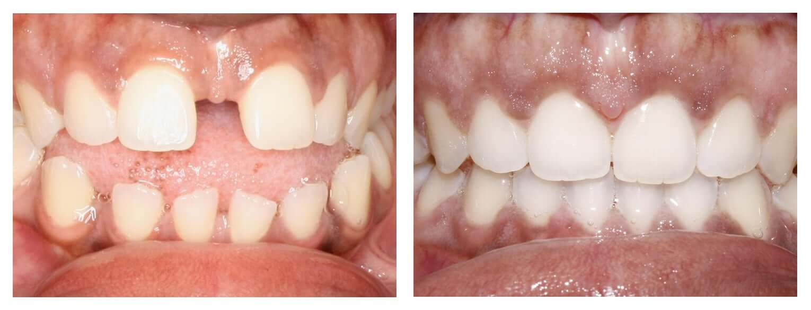

Thinking about getting Invisalign, but not sure what the results will be? There’s nothing better than *seeing* the results from actual patients and hearing about their experiences. These Invisalign before and after pictures will give you a sense of the kind of movement possible with Invisalign, in just under a year.

> “Before I never really used to smile… Invisalign changed my life in many, many ways.” — Sandra

### Invisalign Before and After Pictures

All of these pictures are of MyOrthodontist’s own patients from all around the North Carolina area. All of them chose us because of our experience with Invisalign (which has earned us [Elite Preferred Provider](/blog/elite-preferred-invisalign-provider/) status.)

Invisalign before and after, gap and spacing issues, adult female

Invisalign before and after, underbite, adult male

Invisalign before and after, crowding and spacing issues, teenage male (Invisalign Teen)

### What Patients are Saying

We think the [before and after results speak for themselves](/blog/invisalign-results/). Then again, it’s always nice to hear how lives have been changed, for the better, by Invisalign:

> “When I was in my twenties, I realized that my teeth were shifting back, becoming ‘buck teeth’… When I got my wedding photos back, all I could focus on was how crooked my teeth had become… I was always self-conscious. Post Invisalign, it just takes one more worry away from you.” –Danni
>
> “My treatment has gone by so fast. \[Invisalign\] has made such a difference in my life.” –Katrina
>
> “From a distance, you can’t even tell \[I’m wearing Invisalign Teen.\] It’s *awesome*. It makes you feel better about yourself. I definitely feel more confident.” –Amanda

You can also see reviews from people in your area! See what MyOrthodontist experience has been like from folks living and working near you:

### Still Have Questions?

If you’re looking to restore your smile to its best, and are thinking about Invisalign but still have some questions, we can help. You can call us toll free at 1-888-343-6838, or simply start with some of our free articles on Invisalign:

[Is Invisalign Right for Me?](/blog/is-invisalign-right-for-me/)

[Braces vs Invisalign > From an Orthodontist That Uses Both](/blog/braces-vs-invisalign/)

[Invisalign FAQ: What You Really Need to Know Before Committing](/blog/invisalign-faq/)

[How Long Does Invisalign Take To Straighten Teeth?](/blog/how-long-does-invisalign-take-to-straighten-teeth/)

[What Does Invisalign Cost?](/blog/invisalign-cost/)

[Does Insurance Cover Invisalign in North Carolina?](/blog/does-insurance-cover-invisalign/)

[FIND A LOCATION NEAR YOU](/locations/) [EXPLORE INVISALIGN DEALS](/special-offers/)
