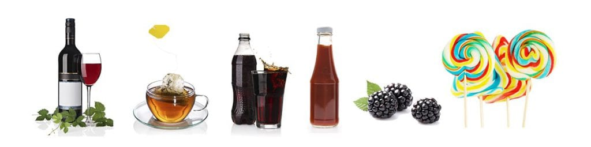

**Make smart choices in your diet for a whiter smile.** The best way to keep your smile healthy and white is to follow a daily oral care routine. But you can do a lot to help the process by also avoiding foods and drinks that commonly discolor teeth. Even if you brush and floss regularly it may not be possible to remove the stains that accumulate from snacks and beverages you consume each day. Learn what to cut back on or avoid entirely so that your smile remains a radiant white throughout your life.

### What Foods and Drinks Discolor Teeth?

-   **Wine:** Red wine contains **chromogens and tannins** which are notorious for staining teeth. What many people do not realize is that white wine can also discolor teeth. It is not the white wine itself that does the staining, but research has show the drink can make your teeth more vulnerable to other causes of stains.
-   **Tea:** Tea is also heavy in tannins and actually has more of these staining agents than coffee does. Black tea (commonly used for iced tea) is the worst for causing stains, so if possible try to stick to herbal, green, and white teas.
-   **Cola:** Your favorite brown soda is heavy in stain-causing chromogens. But even lighter colored sodas can contribute to the problem. That’s because they are **high in acid** which can make your teeth more susceptible to other staining agents.
-   **Sports Drinks:** Like cola, these drinks are high in acid which wears down the enamel on your teeth. The less enamel you have, the less ability you have to resist stains.
-   **Berries:** Intensely colored fruits like **blueberries, blackberries,** **cranberries, cherries, grapes, and pomegranates** can all discolor teeth if they are consumed in high enough quantities over a long enough period of time.
-   **Sauces:** Sauces that have a bright color like tomato sauce, soy sauce, and curry sauce are believed to leave stains behind.
-   **Candy:** Many candies contain intense chemical coloring agents to give them their vibrant colors. These agents are strong enough that they can alter the natural white color of your teeth. A good rule of thumb is that if changes the color of your tongue it will likely change the color of your teeth.
-   **Smoking:** This is neither a food nor drink, but it does have a major impact on the color of your teeth. Smoking is terrible for you oral health generally and contributes significantly to unsightly stains that are difficult and sometimes impossible to remove.

### Maintain a White Smile with the Help of MyOrthodontist

As the saying goes, all things in moderation. If you occasionally consume moderate quantities of these foods and drinks, you shouldn’t worry about waking up the next day with an odd looking smile. And if you **rinse your mouth out with water** soon after consuming these foods you can do a lot to cut down on the stain potential. If you’re interested in taking further steps to whiten your smile, schedule a consultation at [MyOrthodontist](/locations/) location nearest you.

[Learn About Us](/about/)

Are you a [new patient](/special-offers/)?
